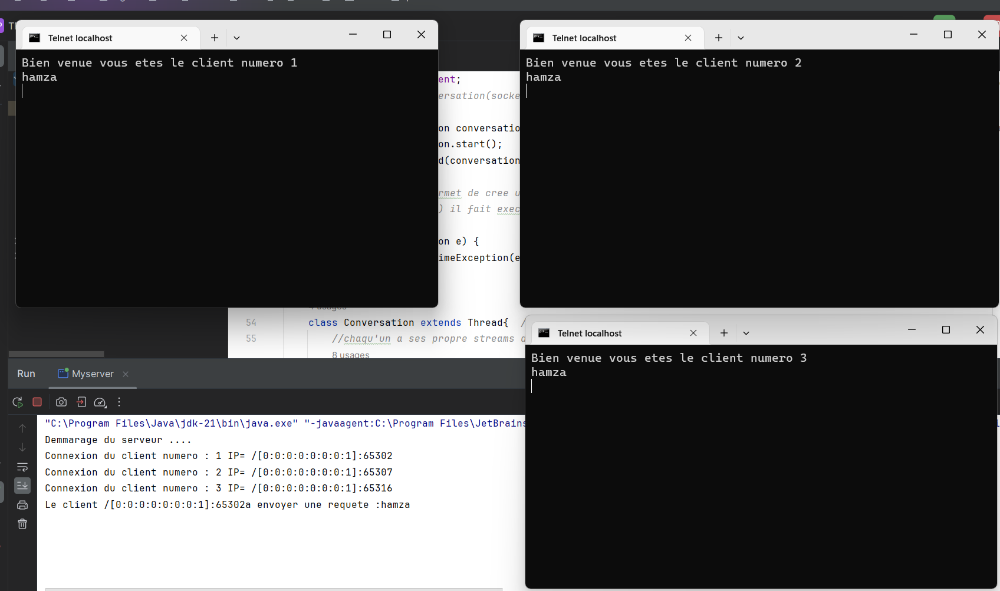
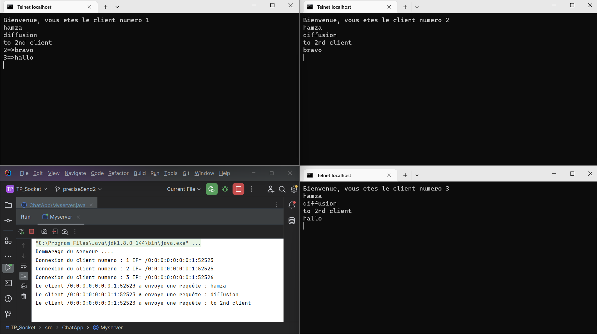
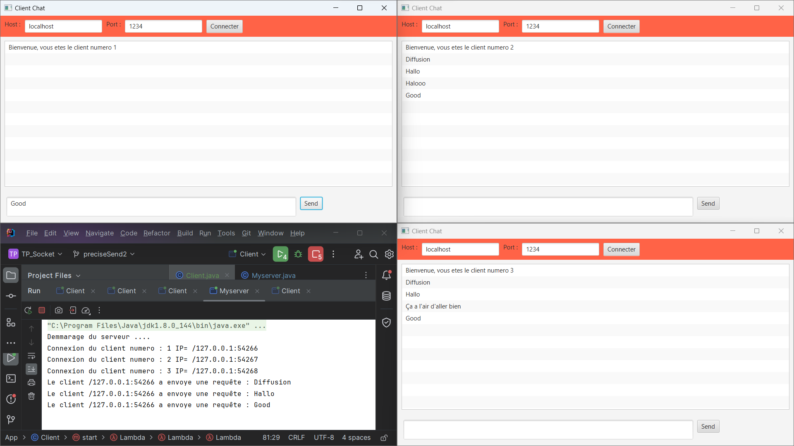

<h1>Serveur de Chat en Java</h1>

Ce projet implémente un serveur de chat en Java, permettant la communication entre plusieurs clients via un serveur centralisé. Le serveur transfère les messages des clients vers leurs destinataires, facilitant ainsi une communication peer-to-peer.

<h2>Fonctionnalités</h2>

Nous sommes en train de developper un protocole de communication reseau au niveau de la couche application du protocole TCP/IP idem a HTTP ou un serveur Apache 

<ul>
    <li><strong>Connexion des clients</strong> : Les clients peuvent se connecter au serveur et maintenir une liste de connexions actives.</li>
    <li><strong>Diffusion de messages</strong> : Les messages peuvent être diffusés à tous les clients connectés, à l'exception de l'expéditeur.</li>
    <li><strong>Communication ciblée</strong> : Les messages peuvent être envoyés à des clients spécifiques en utilisant leur numéro d'identification.</li>
    <li><strong>Gestion des connexions</strong> : Le serveur garde une trace des connexions des clients et permet de les gérer efficacement.</li>
</ul>

<h2>Installation</h2>
<ol>
    <li>Clonez le dépôt :
        <pre><code>git clone https://github.com/votre-utilisateur/serveur-chat-java.git</code></pre>
    </li>
    <li>Naviguez dans le répertoire du projet :</li>
    <li>Compilez les fichiers Java :</li>
</ol>

<h2>Utilisation</h2>
<ol>
    <li>Démarrez le serveur de chat :
        <pre><code>java Myserver</code></pre>
    </li>
    <li>Connectez des clients au serveur en démarrant plusieurs instances du client windows telnet:
        <pre><code>telnet localhost port</code></pre>
    </li>
</ol>

<h2>Exemple de Fonctionnement</h2>
<ol>
    <li>Le serveur démarre et écoute les connexions des clients.</li>
    <li>Les clients se connectent au serveur et peuvent envoyer des messages.</li>
    <li>Les messages sont diffusés à tous les clients, sauf à l'expéditeur.

</li>
    <li>Les clients peuvent spécifier un destinataire spécifique pour leurs messages.

</li>
</ol>

<h2>Améliorations</h2>
<ul>
    <li><strong>Interface Graphique</strong> : Création d'une interface graphique pour le client en utilisant JavaFX.

</li>
<h2>Améliorations Futures</h2>
    <li><strong>Authentification</strong> : Ajouter un système d'authentification pour les utilisateurs.</li>
    <li><strong>Journalisation</strong> : Implémenter la journalisation des messages pour une meilleure traçabilité.</li>
</ul>

<h2>Contribution</h2>

Les contributions sont les bienvenues ! Veuillez soumettre des demandes de tirage (pull requests) pour toute fonctionnalité ou correction de bug.

